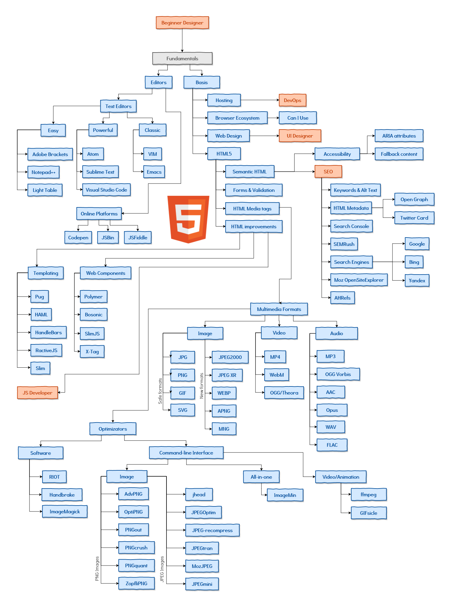
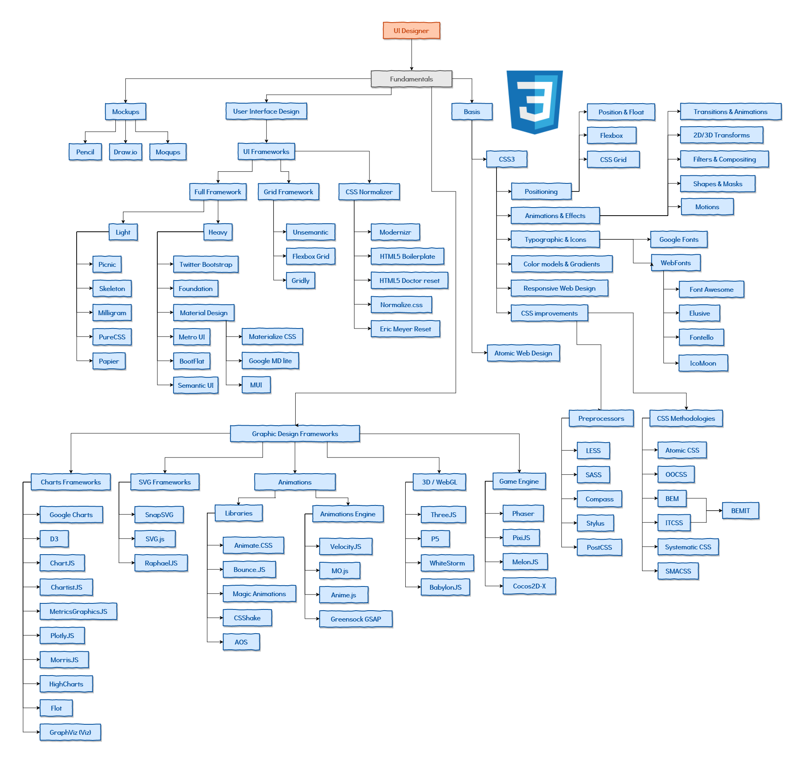
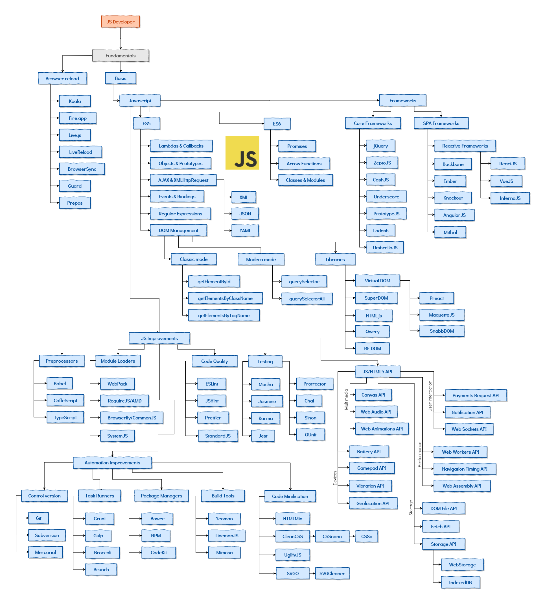

# Roadmap Web Developer 2017
> Front-end Technologies to learn in 2017

### HTML5 Front-end Developer

### UI Front-end Developer

### JS Front-end Developer

**NOTE:** This roadmap is _under construction_. Please be constructive and propose improvements instead of complaining because your preferred technology is not in the pictures.

Author: [@Manz](https://twitter.com/Manz)
Documentation and cheatsheets: [LenguajeHTML.com](https://lenguajecss.com/) · [LenguajeCSS.com](https://lenguajecss.com/) · [LenguajeJS.com](https://lenguajecss.com/)
